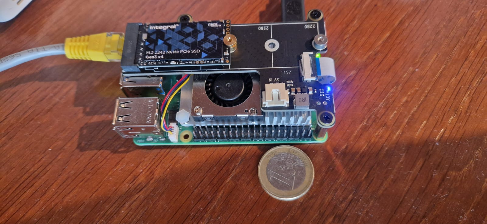

# pi-cluster
The RaspberryPi cluster for my Kubernetes Homelab running with k3s

The Kubernetes cluster is always manintained in the .yaml files in this repository, Flux service running on the RaspberryPi is automatically pulling changes from this repository deploying it to the Kubernetes cluster. 

Applications hosted: 
- Linkding (bookmarks manager)  https://linkding.hansjlachmann.net/
- Mealie https://mealie.hansjlachmann.net/
- Seafile personal file storage (replaces Google Drive, Dropbox etc.) - this is a very good alternative if you have a Linux workstation because Google Drive does not offer Linux sync clients. See official seafile page for details: https://www.seafile.com/en/download/
- Cloudflare tunnel
- Storage containers


Using the Repository structure in the Flux guides:
https://fluxcd.io/flux/guides/repository-structure/
```
├── apps
│   ├── base
│   ├── production 
│   └── staging
├── infrastructure
│   ├── base
│   ├── production 
│   └── staging
└── clusters
    ├── production
    └── staging
```
All changes (deployments) to the kubernetes cluster will be manintained in the yaml files in the /apps directory

RaspberryPi 5  and 16GB Ram with external SDD 



