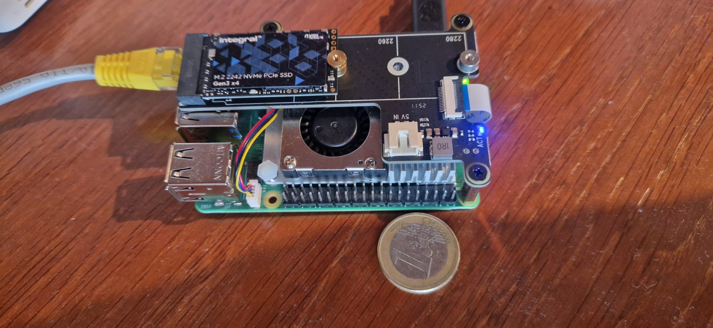

# pi-cluster
The RaspberryPi cluster for my Kubernetes Homelab running with k3s

The Kubernetes cluster is always manintained in the .yaml files in this repository, Flux service running on the RaspberryPi is automatically pulling changes from this repository deploying it to the Kubernetes cluster. 

Applications hosted: 
- Linkding (bookmarks manager)  https://linkding.hansjlachmann.net/
- Mealie https://mealie.hansjlachmann.net/
- Seafile personal file storage (replaces Google Drive, Dropbox etc.) - this is a very good alternative if you have a Linux workstation because Google Drive does not offer Linux sync clients. See official seafile page for details: https://www.seafile.com/en/download/
- Audiobookshelf  https://audiobookshelf.hansjlachmann.net/
- OpenERP  https://openerp.hansjlachmann.net/
- n8n  https://n8n.hansjlachmann.net/
- verifactucloud.com landing page  https://verifactucloud.com/  (deployed from a separate private repo — see "Deploying a new application" below)
- Cloudflare tunnel
- Storage containers


Using the Repository structure in the Flux guides:
https://fluxcd.io/flux/guides/repository-structure/
```
├── apps
│   ├── base            # app definitions (HelmReleases / Deployments)
│   └── staging         # the one live overlay (apps → ./apps/staging)
├── infrastructure
│   ├── controllers     # cert-manager, cloudflared, etc.
│   └── configs         # ClusterIssuers and other config that depend on controllers
└── clusters
    └── staging         # Flux Kustomizations that tie it all together
```
This is a **single-node cluster with one environment** (there is no separate `production`). The Flux template assumes one cluster per environment, so when a real production cluster exists later, add `clusters/production/` and bootstrap Flux there.

Apps whose manifests live **in this repo** are maintained under `/apps`. Apps whose manifests live in **their own private repo** (like verifactucloud-web) are pulled directly by Flux — see below.

RaspberryPi 5  and 16GB Ram with external SDD 


---

# Deploying a new application (from its own private repo)

This is the pattern used by `verifactucloud-web`: the application lives in its **own private GitHub repo** (Dockerfile, CI, and Kubernetes manifests under `deploy/k8s/`), and this pi-cluster repo just holds a small pointer telling Flux where to pull it from. Flux reconciles both repos onto the cluster.

Once wired, deployment is **fully automatic**: push to the app repo's `main` → its CI builds and pushes the image and commits the new image tag → Flux notices the commit and rolls it out (≤ ~5 min).

There are two sides. **Side A** is done once per app in the *application* repo. **Side B** is done once per app in *this* repo.

## Side A — in the application repo (private)

The app repo must provide:

1. **A Dockerfile**, and CI that on push to `main`:
   - builds a **multi-arch image including `linux/arm64`** (QEMU + buildx) — the Pi is arm64, an amd64-only image will not run;
   - pushes to `ghcr.io/<org>/<repo>:<git-sha>`;
   - declares `permissions: { contents: write, packages: write }`;
   - after pushing, **commits the new image tag** back to `deploy/k8s/kustomization.yaml` so Flux deploys it. The commit message must contain `[skip ci]` to avoid a build loop. Minimal step:
     ```yaml
     - name: Pin image and commit
       if: github.event_name == 'push'
       run: |
         cd deploy/k8s
         curl -sSfL https://raw.githubusercontent.com/kubernetes-sigs/kustomize/master/hack/install_kustomize.sh | bash
         ./kustomize edit set image ${IMAGE}=${IMAGE}:${GITHUB_SHA}
         rm -f kustomize
         cd ../..
         if ! git diff --quiet -- deploy/k8s/kustomization.yaml; then
           git config user.name  "github-actions[bot]"
           git config user.email "41898282+github-actions[bot]@users.noreply.github.com"
           git commit -m "Deploy ${GITHUB_SHA} [skip ci]" deploy/k8s/kustomization.yaml
           git push
         fi
     ```
2. **A self-contained kustomize base at `deploy/k8s/`**: `namespace.yaml`, `deployment.yaml`, `service.yaml`, `ingress.yaml`, `kustomization.yaml` (with an `images:` pin that CI bumps).
   - The **Ingress** uses `ingressClassName: traefik` and has **no `tls:` block and no cert-manager annotation** — TLS is terminated at the Cloudflare edge, and traffic inside the tunnel is plain HTTP.
3. **Because the container image is in a private GHCR package**, the pod needs a pull secret:
   - Create a classic GitHub PAT with only the `read:packages` scope.
   - Render and SOPS-encrypt the secret into the app repo (the app repo needs its own `.sops.yaml` using the cluster's age recipient — see `age:` in `clusters/staging/.sops.yaml`):
     ```bash
     kubectl create secret docker-registry ghcr-pull \
       --docker-server=ghcr.io --docker-username=<github-user> \
       --docker-password="$TOKEN" --namespace=<namespace> \
       --dry-run=client -o yaml > deploy/k8s/ghcr-pull-secret.yaml
     sops --encrypt --in-place deploy/k8s/ghcr-pull-secret.yaml   # .dockerconfigjson must show ENC[...]
     ```
   - Add `ghcr-pull-secret.yaml` to `deploy/k8s/kustomization.yaml` resources, and reference it on the Deployment:
     ```yaml
     spec:
       imagePullSecrets:
         - name: ghcr-pull
     ```
   - **Alternative — create the secret directly in the cluster** instead of committing it (drop the `--dry-run` and `sops` steps, run the `kubectl create secret` straight against the cluster). The pod still references `imagePullSecrets: [name: ghcr-pull]`, but the secret is **not** in git — so the app repo needs no `.sops.yaml` and the Kustomization needs no `decryption:` block (Side B step 3). No age key to distribute, nothing to decrypt. See `verifactu`, which does it this way. Trade-off: the secret isn't reproducible from git, so recreate it if the cluster is rebuilt (same caveat as the Flux deploy key). **Whichever you choose, do not later delete a committed pull secret from git while the Kustomization has `prune: true` — that deletes the live secret and breaks image pulls; migrate with adopt-then-remove instead.**

## Side B — wiring it into the cluster (this repo), once per app

Replace `<name>`, `<org>/<repo>`, `<host>`, `<deployment>`, `<namespace>` throughout.

**1. Give Flux a read-only deploy key** (the app repo is private, so Flux needs credentials to pull it). Run from the Pi:
```bash
flux create secret git <name> \
  --url=ssh://git@github.com/<org>/<repo> \
  --namespace=flux-system
```
This creates the secret in-cluster and prints an SSH **public** key. Add that key to the app repo → **Settings → Deploy keys → Add deploy key**, leaving **"Allow write access" unchecked**.

**2. Create `clusters/staging/<name>-source.yaml`** (where Flux pulls from — `secretRef` is the key from step 1):
```yaml
apiVersion: source.toolkit.fluxcd.io/v1
kind: GitRepository
metadata:
  name: <name>
  namespace: flux-system
spec:
  interval: 5m
  url: ssh://git@github.com/<org>/<repo>
  ref:
    branch: main
  secretRef:
    name: <name>
```

**3. Create `clusters/staging/<name>.yaml`** (what Flux applies). Include the `decryption:` block whenever the app ships SOPS-encrypted secrets (e.g. the `ghcr-pull` secret above) — it is required for private images:
```yaml
apiVersion: kustomize.toolkit.fluxcd.io/v1
kind: Kustomization
metadata:
  name: <name>
  namespace: flux-system
spec:
  interval: 10m
  retryInterval: 1m
  timeout: 5m
  path: ./deploy/k8s
  prune: true
  wait: true
  sourceRef:
    kind: GitRepository
    name: <name>
  decryption:
    provider: sops
    secretRef:
      name: sops-age
  healthChecks:
    - apiVersion: apps/v1
      kind: Deployment
      name: <deployment>
      namespace: <namespace>
```

**4. Expose it through the Cloudflare tunnel.** Add a rule to `infrastructure/controllers/base/cloudflared/configmap.yaml` inside the `ingress:` list (keep the `http_status:404` default rule last):
```yaml
      - hostname: <host>
        service: http://traefik.kube-system.svc.cluster.local:80
```
Cloudflared only reads its config at startup, so after this reconciles, restart it:
```bash
kubectl -n cloudflared rollout restart deployment cloudflared
```

**5. DNS.** In Cloudflare, add a **Proxied** (orange-cloud) `CNAME` for `<host>` → `21d3e1bf-81c0-4405-a31c-3593bb2a01ef.cfargotunnel.com`, and set the zone's SSL/TLS mode to **Full**. (Existing `*.hansjlachmann.net` hosts may already resolve; a brand-new custom domain must first be added to the Cloudflare account.)

**6. Commit, push, and reconcile:**
```bash
git add clusters/staging/<name>-source.yaml clusters/staging/<name>.yaml \
        infrastructure/controllers/base/cloudflared/configmap.yaml
git commit -m "Deploy <name>"
git push

flux reconcile kustomization flux-system --with-source
flux reconcile kustomization infrastructure-controllers --with-source   # applies the cloudflared change
flux reconcile kustomization <name> --with-source
```

**7. Verify:**
```bash
flux get kustomization <name>            # READY True
kubectl -n <namespace> get deploy,pod,ing  # pods Running (not ImagePullBackOff)
curl -sSI https://<host> | head -5       # HTTP/2 200
```

Side B is done once. After that, every push to the app repo's `main` deploys itself.


